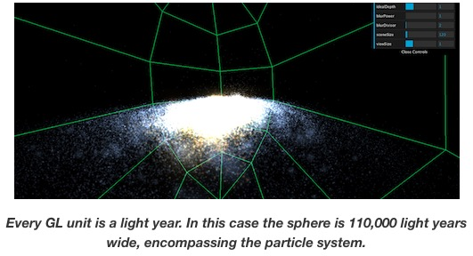

#### 了解自动播放的流程

#### 更新日志

该项目使用HTML+JavaScript开发完成，没有使用模块化组件实现。

程序入口 main.js 的 start 函数.

underscore.js: http://underscorejs.org, jquery主要是用于处理js和html页面交互的，封装了很多操作dom的方法，以及ajax，相比于原生的js更加的简洁，提高了开发效率。而underscore则可以理解为一个js的函数库，其中主要封装了一些常用的js方法，比如数组操作的map，reduce，filter等等，不过这些函数大多在es6中已经实现了。类似underscore的还是lodash，都是辅助js开发的.

jquery.mousewheel.js: 是一个用于添加跨浏览器的鼠标滚轮支持的 jQuery 插件

jquery.preventMacBackScroll.js: Prevent horizontal scroll for Back page in Mac 10.7+

urlArgs.js: 返回 window.urlArgs，似乎没有被其它地方调用。

infocallout.js：

starsystems.js：星系数据定义文件

starmodel.js：星模型

css3worldspace.js:

helphud.js: help元素的隐藏控制

spacehelpers.js: 

shaderlist.js: 着色器加载功能

skybox.js: 天空盒子管理器，包括初始化和更新

plane.js: 生成太空平面网格对象

guides.js: 生成太空半径、距离度量网格对象

dust.js: 生成灰尘粒子系统

lensflare.js: 星 flare 管理

hipparcos.js: 生成星系

galaxy.js: 生成星空

solarsystem.js: 生成太阳系

sun.js: 生成太阳

legacymarkers.js: These markers use screenspace by doing fancy 3D to 2D calculations

marker.js: 标记管理

tour.js: 旅程管理

main.js: 程序入口

jquery.tooltip.js： 一款jQuery消息提示插件tooltip.js，鼠标悬停在设置好的文字上时，会有一个消息提示框弹出，并显示预设的文字内容，鼠标离开时消息提示框则自动消息，消息提示的样式有黑色和白色两种，当然，可以自由扩展的。

minimap.js: 创建和控制页面头部的Tour、Toggle、Audio按钮。启动时自动执行 minimap.js

#### 介绍

本项目基于[Michael Chang](https://www.html5rocks.com/en/tutorials/casestudies/100000stars/)工作基础上的提炼和扩展！

数据来源于[astronexus](http://astronexus.com/)

完成了[100,000](http://workshop.chromeexperiments.com/stars)颗星的可视化，关于恒星的一个[Chrome实验](http://chromeexperiments.com/)。 该项目是基于THREE.js和CSS3D构建的。 在本案例中，将概述研究过程，分享一些编程技巧，并谈一些未来改进的想法。

这里讨论的主题相当广泛，需要一些THREE.js的知识。首先，将展示项目的渲染部分，然后是着色器管理，最后是如何将CSS文本标签与WebGL结合使用。


#### Discovering Space

在我们完成[Small Arms Globe](https://github.com/enigmawxy/three-bi)之后不久，我正在尝试使用具有景深的THREE.js粒子演示。 我注意到我可以通过调整应用的效果量来改变场景的解释“比例”。 当景深效果非常极端时，远处的物体变得非常模糊，类似于倾斜移位摄影的工作方式，给人一种观察微观场景的错觉。 相反，拒绝效果使你看起来好像在盯着深空。

我开始寻找可用于注入粒子位置的数据，这条路径引导我访问[astronexus.com](http://astronexus.com/hyg)的HYG数据库，这是三个数据源（Hipparcos，Yale Bright Star Catalog和Gliese/Jahreiss Catalog）的汇编，附有预计算好的xyz笛卡尔坐标。 让我们开始！


花了大约一个小时的时间将恒星数据放在3D空间中。数据集中有119,617颗恒星，所以用粒子代表每颗恒星对于现代GPU来说不是问题。 还有87个单独识别的星星，因此我使用我在Small Arms Globe中描述的相同技术创建了CSS标记叠加。

在这段时间里，我刚刚完成了[质量效应](http://masseffect.bioware.com/)系列。 在游戏中，玩家被邀请探索星系并[扫描各种行星并阅读](https://www.youtube.com/watch?v=1g92-pgyJrU)他们完全虚构的，维基百科的历史：这个星球上有哪些物种繁荣，它的地质历史等等。

知道关于恒星的实际数据的丰富，可以想象地以相同的方式呈现关于星系的真实信息。 该项目的最终目标是将这些数据变为现实，让观众探索星系效应的星系，了解恒星及其分布，并希望激发对空间的敬畏和疑惑。唷！

我应该在本案例研究的其余部分开头，说我绝不是天文学家，这是业余研究的工作，得到了外部专家的一些建议的支持。 这个项目绝对应该被解释为艺术家对空间的解释

#### Building a Galaxy
我的计划是在程序上生成一个星系模型，可以将星系数据放在上下文中 - 并希望能够对我们在银河系中的位置给出一个很棒的视图。


为了产生银河系，我通过模仿银河系形成的方式，产生了100,000颗颗粒并将它们放置成螺旋状。 我并不太担心螺旋臂形成的细节，因为这将是一个代表性模型而不是数学模型。 然而，我确实尝试使螺旋臂的数量或多或少正确，并在“正确的方向”旋转。

在银河系模型的后期版本中，我不再强调使用粒子来支持星系的平面图像以伴随粒子，希望它给它带来更多的摄影外观。 实际图像是旋转星系NGC 1232，离我们大约7000万光年，图像处理看起来像银河系。



我很早就决定代表一个GL单位，基本上是3D中的一个像素，作为一个光年 - 一个统一放置所有可视化的惯例，不幸的是后来给了我严重的精确度问题。

我决定的另一个约定是旋转整个场景而不是移动相机，这是我在其他几个项目中完成的。 一个优点是将所有内容放置在“转盘”上，以便鼠标左右拖动旋转相关对象，但放大只是改变camera.position.z的问题。

相机的视野（或FOV）也是动态的。 当一个人向外拉时，视野变宽，吸收了越来越多的星系。 当向内朝向恒星移动时，情况正好相反，视野变窄。 这使得相机可以通过将FOV压缩成类似神的放大镜而无需处理近平面剪裁问题来查看无限小的事物（与星系相比）。


从这里开始，我能够将太阳“放置”在离银河核心远的地方。 我还能够通过绘制出[Kuiper Cliff](http://en.wikipedia.org/wiki/Kuiper_cliff#.22Kuiper_cliff.22)的半径（我最终选择可视化[Oort Cloud](http://en.wikipedia.org/wiki/Oort_cloud)）来可视化太阳系的相对大小。 在这个模型太阳系中，我还可以想象一个简化的地球轨道，以及太阳的实际半径。


太阳很难渲染。 我不得不欺骗尽可能多的实时图形技术。 太阳表面是等离子体的热泡沫，需要随着时间的推移而发生脉冲和变化。 这是通过太阳表面的红外图像的位图纹理来模拟的。 表面着色器根据此纹理的灰度进行颜色查找，并在单独的颜色渐变中执行查找。 当这种查找随着时间的推移而移动时，会产生这种类似熔岩的失真。

类似的技术被用于太阳的日冕，除了它是一个扁平的精灵卡片，总是面向相机使用THREE.Gyroscope().


太阳耀斑是通过应用于环面的顶点和碎片着色器创建的，围绕太阳表面的边缘旋转。 顶点着色器具有噪声功能，使其以类似blob的方式编织。

正是在这里，由于GL的精确性，我开始经历一些z-fighting问题。 精度的所有变量都是在THREE.js中预先定义的，所以如果没有大量的工作，我就无法逼真地提高精度。 精确度问题在原点附近并没有那么糟糕。 然而，一旦我开始建模其他星系，这就成了一个问题。


我用了一些黑客来缓解z-fighting问题。 THREE的Material.polygonoffset是一个允许多边形在不同的感知位置渲染的属性（据我所知）。 这用于迫使电晕平面始终渲染在太阳表面的顶部。 在此之下，渲染太阳“光环”以使尖锐的光线远离球体。

与精度相关的另一个问题是，当场景放大时，星模型会开始抖动。为了解决这个问题，我必须“清零”场景旋转并分别旋转星形模型和环境贴图，以给出您正在轨道运行的错觉星。
#### Creating Lensflare


空间可视化是我觉得我可以通过过度使用lensflare逃脱的地方。 [THREE.LensFlare](https://github.com/mrdoob/three.js/blob/master/src/extras/objects/LensFlare.js)用于此目的，我需要做的就是抛出一些变形六边形和一些[JJ艾布拉姆斯](http://en.wikipedia.org/wiki/J._J._Abrams)。 下面的代码段显示了如何在场景中构建它们。
```javascript
//	This function retuns a lesnflare THREE object to be .add()ed to the scene graph
function addLensFlare(x,y,z, size, overrideImage){
  var flareColor = new THREE.Color( 0xffffff );

  lensFlare = new THREE.LensFlare( overrideImage, 700, 0.0, THREE.AdditiveBlending, flareColor );

  //	we're going to be using multiple sub-lens-flare artifacts, each with a different size
  lensFlare.add( textureFlare1, 4096, 0.0, THREE.AdditiveBlending );
  lensFlare.add( textureFlare2, 512, 0.0, THREE.AdditiveBlending );
  lensFlare.add( textureFlare2, 512, 0.0, THREE.AdditiveBlending );
  lensFlare.add( textureFlare2, 512, 0.0, THREE.AdditiveBlending );

  //	and run each through a function below
  lensFlare.customUpdateCallback = lensFlareUpdateCallback;

  lensFlare.position = new THREE.Vector3(x,y,z);
  lensFlare.size = size ? size : 16000 ;
  return lensFlare;
}

//	this function will operate over each lensflare artifact, moving them around the screen
function lensFlareUpdateCallback( object ) {
  var f, fl = this.lensFlares.length;
  var flare;
  var vecX = -this.positionScreen.x * 2;
  var vecY = -this.positionScreen.y * 2;
  var size = object.size ? object.size : 16000;

  var camDistance = camera.position.length();

  for( f = 0; f < fl; f ++ ) {
    flare = this.lensFlares[ f ];

    flare.x = this.positionScreen.x + vecX * flare.distance;
    flare.y = this.positionScreen.y + vecY * flare.distance;

    flare.scale = size / camDistance;
    flare.rotation = 0;
  }
}
```

一种简单的方法来进行纹理滚动


对于地理上的平面，在太阳中心使用创建一个巨大的THREE.CylinderGeometry()对象。为了创造向外扇动的“光波”，我随着时间的推移修改了它的纹理偏移
```javascript
mesh.material.map.needsUpdate = true;
mesh.material.map.onUpdate = function(){
  this.offset.y -= 0.001;
  this.needsUpdate = true;
}

```
地图是属于材质的贴图，可以在onUpdate功能中修改功能。设置其偏移量会导致纹理沿着该轴“滚动”，设置needsUpdate = true会强制此行为循环。

#### Using color ramps
根据天文学家指定的“颜色指数”，每颗恒星都有不同的颜色。 一般来说，红色星星较冷，蓝色/紫色星星较热。 此渐变中存在一条白色和中间橙色的色带。

渲染星星时，我想根据这些数据为每个粒子赋予自己的颜色。 这样做的方法是给应用于粒子的着色器材料赋予“属性”。
```javascript
var shaderMaterial = new THREE.ShaderMaterial( {
  uniforms: 	datastarUniforms,
  attributes:     datastarAttributes,
  /* ... etc */
});
```

```javascript
var datastarAttributes = {
  size: 		{ type: 'f', value: [] },
  colorIndex: 	{ type: 'f', value: [] },
};
```
填充colorIndex数组会为每个粒子在着色器中赋予其独特的颜色。 通常情况下，一个人会传入一个颜色vec3，但在这种情况下，我正在传递一个浮动，以便最终进行颜色渐变查找。


颜色渐变看起来像这样,但是我需要从JavaScript访问它的位图颜色数据。 我这样做的方法是首先将图像加载到DOM上，将其绘制到canvas元素中，然后访问画布位图.
```javascript
//	make a blank canvas, sized to the image, in this case gradientImage is a dom image element
gradientCanvas = document.createElement('canvas');
gradientCanvas.width = gradientImage.width;
gradientCanvas.height = gradientImage.height;

//	draw the image
gradientCanvas.getContext('2d').drawImage( gradientImage, 0, 0, gradientImage.width, gradientImage.height );

//	a function to grab the pixel color based on a normalized percentage value
gradientCanvas.getColor = function( percentage ){
  return this.getContext('2d').getImageData(percentage * gradientImage.width,0, 1, 1).data;
}
```
然后使用相同的方法在星模型视图中着色单个恒星


#### Shader wrangling
在整个项目中，我发现我需要编写越来越多的着色器来完成所有的视觉效果。 我为此目的编写了一个自定义着色器加载器，因为我厌倦了在index.html中使用着色器
```javascript
//	list of shaders we'll load
var shaderList = ['shaders/starsurface', 'shaders/starhalo', 'shaders/starflare', 'shaders/galacticstars', /*...etc...*/];

//	a small util to pre-fetch all shaders and put them in a data structure (replacing the list above)
function loadShaders( list, callback ){
  var shaders = {};

  var expectedFiles = list.length * 2;
  var loadedFiles = 0;

  function makeCallback( name, type ){
    return function(data){
      if( shaders[name] === undefined ){
        shaders[name] = {};
      }

      shaders[name][type] = data;

      //  check if done
      loadedFiles++;
      if( loadedFiles == expectedFiles ){
        callback( shaders );
      }

    };
  }

  for( var i=0; i<list.length; i++ ){
    var vertexShaderFile = list[i] + '.vsh';
    var fragmentShaderFile = list[i] + '.fsh';

    //	find the filename, use it as the identifier
    var splitted = list[i].split('/');
    var shaderName = splitted[splitted.length-1];
    $(document).load( vertexShaderFile, makeCallback(shaderName, 'vertex') );
    $(document).load( fragmentShaderFile,  makeCallback(shaderName, 'fragment') );
  }
}
```
loadShaders（）函数获取着色器文件名列表（期望片段为.fsh，顶点着色器为.vsh），尝试加载其数据，然后只用对象替换列表。 结果是你可以像这样传递uniform给着色器：
```javascript
var galacticShaderMaterial = new THREE.ShaderMaterial( {
  vertexShader:   shaderList.galacticstars.vertex,
  fragmentShader: shaderList.galacticstars.fragment,
  /*...*/
});
```
我可能已经使用了require.js，尽管为了这个目的需要重新组装一些代码。 这个解决方案虽然容易得多，但我认为可以改进，甚至可以作为THREE.js扩展。 如果您有更好的建议或方法，请告诉我们！

#### CSS Text Labels on top of THREE.js
在我们的上一个项目Small Arms Globe，我在THREE.js场景的顶部使用了文本标签。我使用的方法计算出我希望文本出现的位置的绝对模型位置，然后使用THREE.Projector（）解析屏幕位置，最后使用CSS“top”和“left”将CSS元素放在所需的位置。

关于这个项目的早期迭代使用了相同的技术，但是我一直渴望尝试[Luis Cruz](http://www.emagix.net/academic/mscs-project/item/camera-sync-with-css3-and-webgl-threejs)描述的其他方法。

基本思路：将CSS3D的矩阵变换与THREE的相机和场景相匹配，你可以将CSS元素“放置”在3D中，就像它在三个场景之上一样。 但是有一些限制，例如，您将无法将文本放在THREE.js对象下面。 这仍然比尝试使用“顶部”和“左”CSS属性执行布局快得多。


您可以在此处找到演示（以及视图源代码）。 但是我确实发现矩阵顺序已经改变为THREE.js。 我更新的功能
```javascript
/* Fixes the difference between WebGL coordinates to CSS coordinates    */
function toCSSMatrix(threeMat4, b) {
  var a = threeMat4, f;
  if (b) {
    f = [
      a.elements[0], -a.elements[1], a.elements[2], a.elements[3],
      a.elements[4], -a.elements[5], a.elements[6], a.elements[7],
      a.elements[8], -a.elements[9], a.elements[10], a.elements[11],
      a.elements[12], -a.elements[13], a.elements[14], a.elements[15]
    ];
  } else {
    f = [
      a.elements[0], a.elements[1], a.elements[2], a.elements[3],
      a.elements[4], a.elements[5], a.elements[6], a.elements[7],
      a.elements[8], a.elements[9], a.elements[10], a.elements[11],
      a.elements[12], a.elements[13], a.elements[14], a.elements[15]
    ];
  }
  for (var e in f) {
    f[e] = epsilon(f[e]);
  }
  return "matrix3d(" + f.join(",") + ")";
}
```
由于所有内容都已转换，因此文本不再面向相机。 解决方案是使用[THREE.Gyroscope（）](https://github.com/mrdoob/three.js/blob/master/src/extras/core/Gyroscope.js)强制Object3D从场景中“丢失”其继承的方向。 这种技术被称为“广告牌”，陀螺仪非常适合这样做。

真正令人高兴的是，所有普通的DOM和CSS仍在使用，例如能够将鼠标悬停在3D文本标签上并让它发出阴影.


放大时我发现排版的缩放导致了定位问题。 也许这是由于文本的字距和填充？ 另一个问题是文本在放大时变得像素化，因为DOM渲染器将渲染的文本视为纹理四边形，这是使用此方法时需要注意的事项。 回想起来，我本来可以使用巨大的字体大小的文本，也许这是未来探索的东西。 在这个项目中，我还使用了前面描述的“顶部/左侧”CSS放置文本标签，用于太阳系中行星附近的真正小元素

#### Music playback and looping
在“质量效应”的“银河地图”中播放的音乐作品是Bioware作曲家Sam Hulick和Jack Wall，它有一种我希望游客体验的情感。 我们希望在我们的项目中有一些音乐，因为我们觉得它是大气的重要组成部分，有助于创造我们努力追求的敬畏和惊奇感。

我们的制作人Valdean Klump联系了Sam，他有一大堆来自Mass Effect的“cut floor”音乐，他非常慷慨地让我们使用。 该曲目的标题是“在一片奇怪的土地”。

我使用音频标签进行音乐播放，但即使在Chrome中，“循环”属性也不可靠 - 有时它只是无法循环。 最后，这个双音频标签hack用于检查播放结束并循环到另一个标签进行播放。 令人失望的是，这个仍然没有完全循环，唉我觉得这是我能做的最好的.

```javascript
var musicA = document.getElementById('bgmusicA');
var musicB = document.getElementById('bgmusicB');
musicA.addEventListener('ended', function(){
  this.currentTime = 0;
  this.pause();
  var playB = function(){
    musicB.play();
  }
  //	make it wait 15 seconds before playing again
  setTimeout( playB, 15000 );
}, false);

musicB.addEventListener('ended', function(){
  this.currentTime = 0;
  this.pause();
  var playA = function(){
    musicA.play();
  }
  //	otherwise the music will drive you insane
  setTimeout( playA, 15000 );
}, false);

//	okay so there's a bit of code redundancy, I admit it
musicA.play();
```

#### Room for improvement
在与THREE.js合作了一段时间之后，我觉得我已经达到了我的数据与我的代码混合太多的程度。例如，当在线定义材料，纹理和几何指令时，我本质上是“使用代码进行3D建模”。这感觉非常糟糕，并且是THREE.js未来努力可以大大改进的领域，例如在单独的文件中定义材料数据，优选地在某些上下文中可查看和调整，并且可以被带回到主项目中。

我们的同事Ray McClure还花了一些时间创造了一些令人敬畏的生成性“空间噪音”，由于网络音频API不稳定而不得不切断，因此经常会崩溃Chrome。这很不幸......但它确实让我们在声音空间中更多地考虑未来的工作。在撰写本文时，我被告知Web音频API已经过修补，因此现在可以使用它，这是未来需要注意的事项。

与WebGL配对的排版元素仍然是一个挑战，我不能100％确定我们在这里做的是正确的方法。它仍然像一个黑客。也许未来版本的THREE，以及即将推出的CSS Renderer，可以用来更好地加入这两个世界。

#### Credits
感谢Aaron Koblin让我进这个项目。 Jono Brandel完成了出色的UI设计实现，类型处理和巡回实现。 Valdean Klump为项目提供了一个名称和所有副本。 Sabah Ahmed解决了数据和图像源的使用权。 克莱姆赖特伸出合适的人选出版。 Doug Fritz的技术卓越。 George Brower教我JS和CSS。 当然还有Mr.Doob为THREE.js。

#### References

* [Three.js](https://github.com/mrdoob/three.js/)
* [Camera Sync with CSS3 and WebGL THREE.js](http://www.emagix.net/academic/mscs-project/item/camera-sync-with-css3-and-webgl-threejs)
* [Mass Effect](http://masseffect.bioware.com/)
